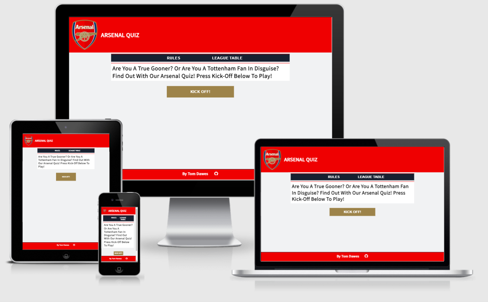
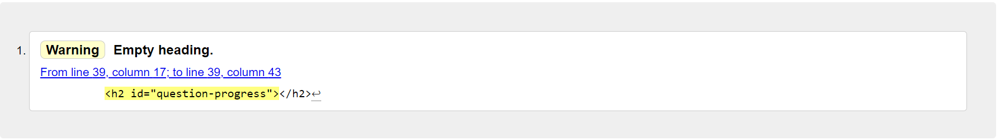
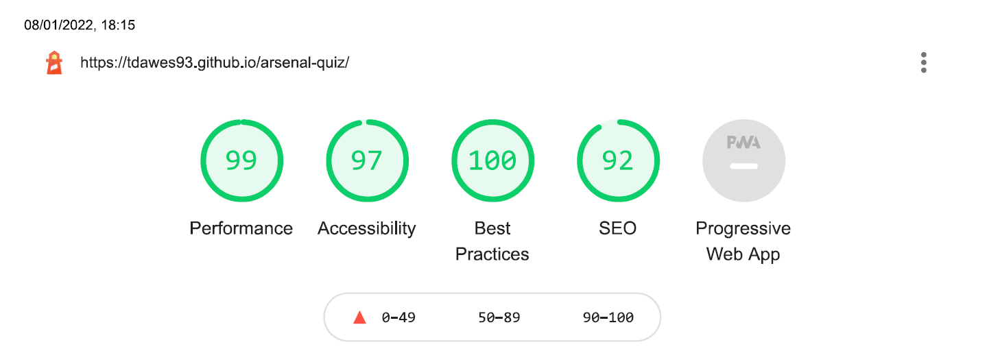

# Arsenal Quiz
This website was built to give users a fun and interactive quiz to test their knowledge of Arsenal FC History. 

This website was made as the fulfillment of the Milestone Project 2 for the Full-Stack Software Development Course provided by Code Institute. It was made using HTML, CSS and JavaScript.

The live website can be found [here](link)

## Table of Contents

- [UX Desgin](#UX-Design)
    - [User Stories](#User-Stories)
    - [Structure](#Structure)
    - [Design](#Design)
        - [Colour Scheme](#Colour-Scheme)
        - [Typography](#Typography)
        - [Imagery](#Imagery)
    - [Wireframes/Skeleton](#Wireframes/Skeleton)
    - [Differences in finished site](#Differences-in-finished-site-to-initial-design)
    - [Limitations](#Limitations)
- [Features](#Features)
    - [Home Page](#Home-Page)
    - [Gallery](#Gallery)
    - [Explore Page](#Explore-Page)
    - [Booking Page](#Booking-Page)
    - [Future Features](#Future-Features-to-Implement)
- [Technologies](#Technologies)
    - [Languages](#Languages)
    - [Tools](#Tools)
- [Testing](#Testing)
    - [Overview](#Overview)
    - [Validator Testing](#Validator-Testing)
    - [Issues/Bugs Resolved During Testing](#Issues/Bugs-Resolved-During-Testing)
    - [Testing User Stories](#Testing-User-Stories)
- [Deployment](#Deployment)
    - [GitHub Pages](#GitHub-Pages)
    - [Fork the GitHub](#Fork-the-GitHub)
    - [Make a local clone](#Make-a-local-clone)
- [Credits](#Credits)
- [Acknowledgments](#Acknowledgments)

****

## UX Design 

### User Stories

#### First Time Visitor Expectations

- As a first-time visitor I want:

    - To understand the purpose of the site and learn how to play the game.
    - To be able to know how to start the quiz and navigate the site immediately.
    - To find the game interesting and challenging.
    - To see my score when the quiz is finished.
    - To be able to play the quiz on all devices.

#### Returning Visitor Expectations

- As a returning/frequent visitor I want:

    - To continue to enjoy the quiz even after multiple attempts.
    - To find the saved League Table and try and beat the highscores.
    - To share my high-score on social media.

### Structure

- A navigation bar will be on the homepage with links to each section/modal. Nav bar titles will be Kick-off, Rules and League-Table. This fulfills the user stories:
    - > "I want to understand the purpose of the site and learn how to play the game."
    - > "To be able to know how to start the quiz and navigate the site immediately."
- The homepage will provide a basic hook line drawing the user in and explaining what to do. This fulfills the user story:
    - >"I want to understand the purpose of the site."
- The use of CSS and media queries will make the website responsive. The initial design will be for mobile devices and the responsive design will ensure the layout changes as the screen size increases. This fulfills the user story:
    - >"I want to be able to play the quiz on all devices"
- The quiz section will contain a question container and then a results container, when the quiz is finished. This will display the score to the user. This will fulfill user story:
    - >" To see my score when the quiz is finished."
- The results modal will contain a short form where the user can input their name and save it to the league table. The league table modal will display the top 20 highscores in order from highest to lowest. This will fulfill the user stories: 
    - >"To see my score when the quiz is finished."
    - >"To be able to play the quiz on all devices."
    - >"To find the saved League Table and try and beat the highscores."
- The rules modal will contain a list of the rules and method to play this quiz. This fulfills user story:
    - >"To be able to know how to start the quiz and navigate the site immediately."
    
### Design

#### Colour Scheme

- The three main colours used were Red #EF0001, White #FFFFFF and Oxford Blue #172030. These colours were taken from the Arsenal FC logo to ensure they are official Arsenal FC colours. This allows the site to be instantly identifiable by football fans. 

- The kick off button is coloured in Metallic Sunburst #9D8349 and the background of the page is coloured in Cultured #F1F2F3. Both these colours are taken from the official Arsenal FC website and stick with the main theme.

#### Typography

- Source Sans Pro is used throughout the site. It is a sharp, clear and crisp font making it easy to read. It is similar to FF Meta which is the font used on the official Arsenal FC site.

- The site uses uppercase for titles and buttons and capitalisation for all other text. This enables readability and allows the buttons to be easily identified.  

- The font has a sans-serif backup.

#### Imagery

- The images were selected as they show famous moments in Arsenal's history. They were chosen to create excitement whilst being a trip down memory lane.

- The images have been resized to be responsive.

### Wireframes/Skeleton

##### Home Page

##### Quiz Container
![Quiz Container Wireframe]

##### Results Modal
[!Results Modal Wireframe]

##### Rules Modal
[!Rules Modal Wireframe]

##### League Table Modal
[!League Table Modal Wireframe]

### Differences in finished site to initial design 
1. The "Kick-off" button is now placed in the centre of the homepage and coloured in gold. It was originally designed to be on the nav bar on the top left. However, after user feedback, during the testing stage, found that many users were unsure how to start the game so it was moved to be more clear and concise. 

### Limitations

***

## Features

### Existing Features

#### Home Page

### Future Features to Implement

- 

***

## Technologies

- Languages
    - HTML was the main language used for structure and layout
    - CSS was used the style the website
    - JavaScript was used to run the game and add functionality to the buttons

- Tools    
    - Font Awesome was used for the icons for the social media links
    - Gitpod was used as an online IDE
    - Github was used as the repository for the source code
    - Google Fonts was used for selecting the font styles
    - Coolers.co was used for creating the colour palette, extracting the main colours from the hero image
    - Balsamiq Wireframes was used to create the wireframes in the Structure section of the design
    - Google Dev Tools was used for debugging throughout development and before deployment 
    - Lighthouse was used to audit the website for quality and accessibility 

***

**

## Testing

### Overview

Testing will be performed on the layout, structure and styling of the website. To do this dev-tools (and its other browser counterparts) will be used to view the site on different browsers and different device sizes.

In addition, the deployed site will be tested directly on different devices. The devices used were:
- Laptop with 1920 x 1080px screen
- Google Pixel 3a phone
- iPhone XR

Testing will look for the following:

- All elements will remain where designed for all screen widths, with no overlapping or misalignment
- All links will direct correctly with external links opening in a new browser tab
- Photo titles will appear when hovered over or click upon (for handheld devices)
- The form inputs take the correct information type and are required
- Media shows clearly and is not distorted
- HTML and CSS will be validated using W3C and Jigsaw
- All pages will have a Lighthouse report generated to test for
    - Performance
    - Accessibility
    - Good Practices
    - SEO
- The User Stories from the UX Design section will also be tested

### Validator Testing

- HTML 
    - The official W3C validator came back with one error. 

     

    - As the empty h2 tag will be filled from the script.js file when the game is run, this issue does not need to be fixed

- CSS
    - The official Jigsaw validator was used and came back with no errors.

### Lighthouse Report
- Lighthouse Reports for the quiz was run for all screen sizes. All areas tested: Performances, Accessibility, Good Practices and SEO were reported to be in the good range of 90-100.

### Issues/Bugs resolved during testing

### Testing User Stories

The user stories explained in the UX Design section were tested to ensure they work as intended and are easy for the users to achieve. 

As a first time visitor I want:

As a returning visitor I want:

As a frequent visitor I want:

***

## Deployment 

### GitHub Pages

The project is hosted by GitHub and deployed using the following steps:

1. Log in to Github and locate the [Arsenal Quiz Repository](https://github.com/tdawes93/arsenal-quiz)
2. Click the settings button on the menu
3. Click 'Pages' on the list on the right or scroll down until you reach 'Github Pages' and click the link
4. Under 'Sources' select 'main' on the drop-down called 'None' and click save
5. The page will refresh with a link to the deployed site at the top, click this to go to the live website.

### Fork the GitHub

If you wish to view or make changes without affecting the original repository you can 'fork the repository'. This creates a copy to your GitHub and can be done using the following steps:

1. Log in to Github and locate the [Arsenal Quiz Repository](https://github.com/tdawes93/arsenal-quiz)
2. At the top right of the repository underneath the notification icon is the 'fork' button
3. Click this button and you should now have a copy of the repository in your Github account

### Make a local clone

1. Log in to Github and locate the [Arsenal Quiz Repository](https://github.com/tdawes93/arsenal-quiz)
2. At the top of the repository next to the 'Gitpod' button click the dropdown named 'Code'
3. To clone the repository using HTTPS, make sure HTTPS is selected and copy the link
4. Open the Git Bash
5. Change the working directory to the location you wish the clone to be made
6. Type 'git clone' and paste the copied URL
7. Press 'Enter' and your local clone will be created

***

## Credits

- Content
    - [Sunshine](https://www.skibanff.com/), [Lake Louise](https://www.skilouise.com/) and [Whistler](https://www.whistler.com/) ski schools as general inspiration for content and layout.

- Code
    - The code for the saveScore function and the appendScore function was taken and adapted from James Q Quick's YouTube series [Build a Quiz App](https://www.youtube.com/channel/UC-T8W79DN6PBnzomelvqJYw).

    - The method and some of the code for the checkAnswer function was taken from David Walsh's article on [Event Delegation](https://davidwalsh.name/event-delegate).

    - The questions and answers were taken from [Fun Trivia Arsenal Section](https://www.funtrivia.com/en/Sports/Arsenal-7231.html).

    - General inspiration for the layout and functionality of the quiz was taken from [Buzzfeed Quizzes](https://www.buzzfeed.com/uk/quizzes) and Paul Bowden's [MP2 project](https://github.com/PaulBowden673/Projects-MP-MP2-Quiz). 

- Media
    - All photos were either downloaded from [Unsplash](https://unsplash.com/) or [Pexels](https://www.pexels.com/).

***

## Acknowledgments

I'd like to thank my mentor Spencer Bariball for his support and feedback throughout the project. I'd also like to thank the group of friends and family I had test and give feedback on the site on their various mobiles and laptops.